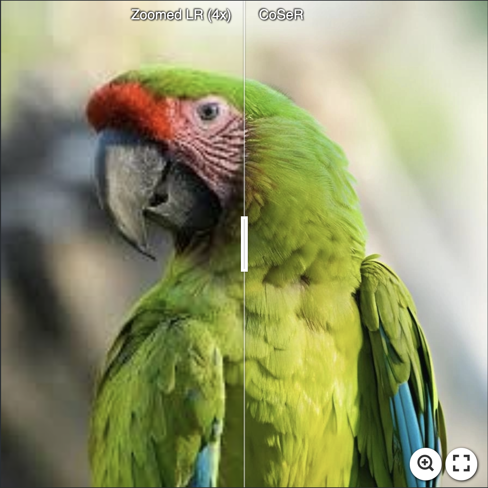
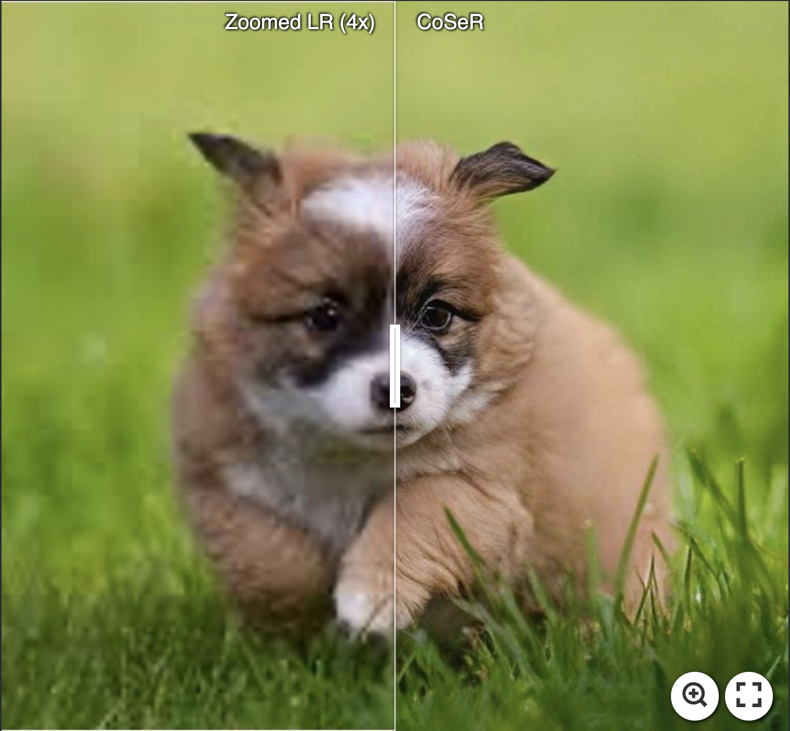
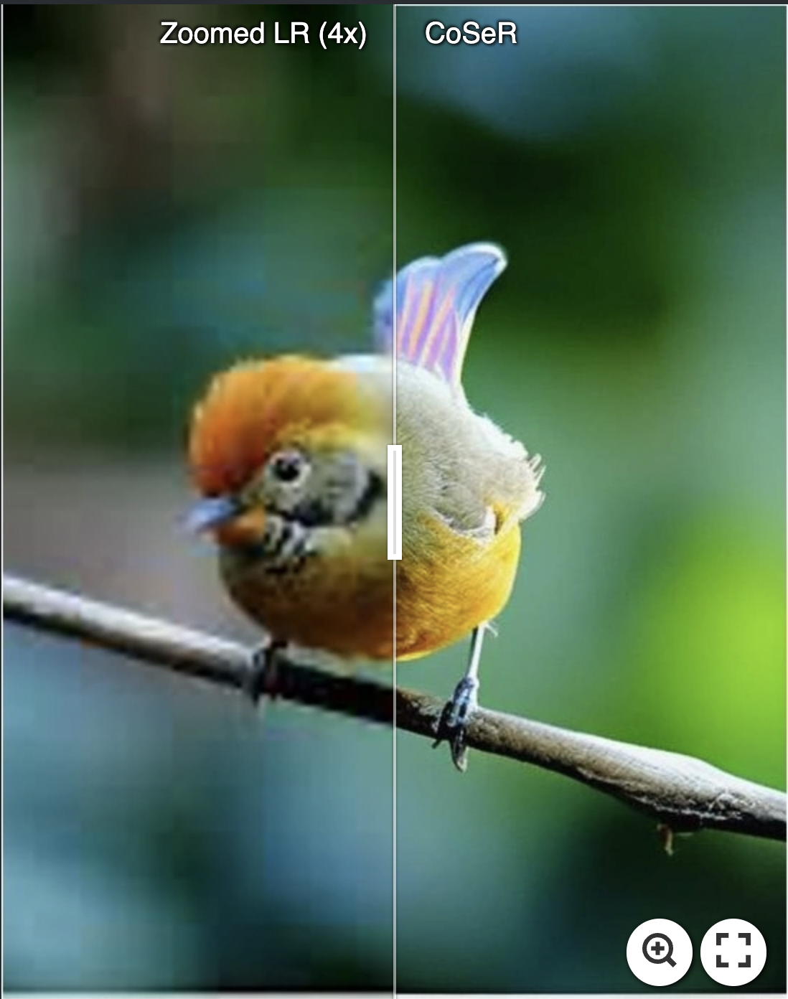
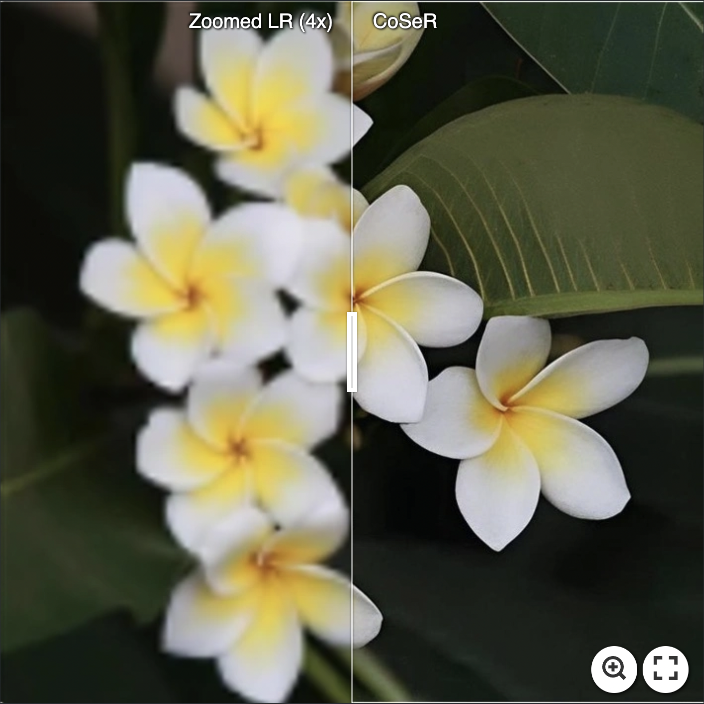

<p align="center">
    
</p>

## CoSeR: Bridging Image and Language for Cognitive Super-Resolution (CVPR 2024)

 <a href='https://arxiv.org/abs/2311.16512'></a> &nbsp;&nbsp;
 <a href='https://coser-main.github.io/'></a> &nbsp;&nbsp;&nbsp;&nbsp;&nbsp;


Haoze Sun<sup>1</sup>, [Wenbo Li](https://fenglinglwb.github.io/)<sup>2,\*</sup>, [Jianzhuang Liu](https://people.ucas.ac.cn/~jzliu?language=en)<sup>2</sup>, [Haoyu Chen](https://haoyuchen.com/)<sup>3</sup>, Renjing Pei<sup>2</sup>, [Xueyi Zou](https://xueyizou.github.io/)<sup>2</sup>, Youliang Yan<sup>2</sup>, [Yujiu Yang](https://sites.google.com/view/iigroup-thu/home)<sup>1,\*</sup>

<div align="center">
<sup>1</sup>Tsinghua University &nbsp;&nbsp;<sup>2</sup>Huawei Noah’s Ark Lab &nbsp;&nbsp;<sup>3</sup>HKUST(GZ)
</div>

<p align="center">
    
</p>

## 📢 Notifications
*We regret to inform you that due to the company's open-source policy, the official release date for CoSeR is yet to be determined. However, you can refer to the reproduction by [Tianhe Wu](https://github.com/TianheWu/CoSeR). We provide guidance throughout the reproduction process, and we sincerely appreciate the efforts Tianhe Wu has made in reproducing CoSeR. We apologize for any inconvenience this may cause to those interested in our work.*

## 🌈 Real-world SR Results
[](https://imgsli.com/MjI4MzMx) [](https://imgsli.com/MjI4MzI5) [](https://imgsli.com/MjI4MzMw)

[](https://imgsli.com/MjI4MzM0) [](https://imgsli.com/MjI4MzM1) [](https://imgsli.com/MjI4MzQx)

## :fireworks: Visual Comparisons

<!-- <details close>
<summary>General Image Restoration</summary> -->
<p align="center">
    
</p>

## 📎 Citation

Please cite our work if you think it is useful for your research.

```
@article{sun2023coser,
  title={CoSeR: Bridging Image and Language for Cognitive Super-Resolution},
  author={Sun, Haoze and Li, Wenbo and Liu, Jianzhuang and Chen, Haoyu and Pei, Renjing and Zou, Xueyi and Yan, Youliang and Yang, Yujiu},
  journal={arXiv preprint arXiv:2311.16512},
  year={2023}
}
```

## 📭 Contact

If your have any comments or questions, feel free to contact shz22@mails.tsinghua.edu.cn.
