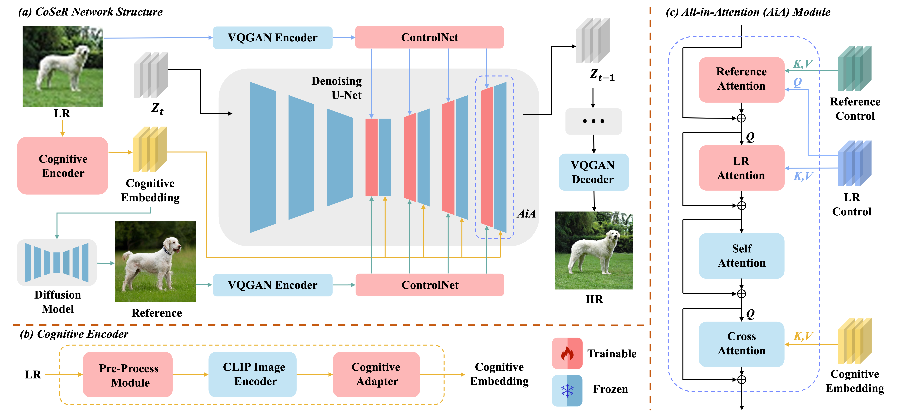

<p align="center">
    
</p>

## CoSeR: Bridging Image and Language for Cognitive Super-Resolution

 <a href='https://arxiv.org/abs/2311.16512'></a> &nbsp;&nbsp;
 <a href='https://coser-main.github.io/'></a> &nbsp;&nbsp;&nbsp;&nbsp;&nbsp;


Haoze Sun<sup>1</sup>, [Wenbo Li](https://fenglinglwb.github.io/)<sup>2,\*</sup>, [Jianzhuang Liu](https://people.ucas.ac.cn/~jzliu?language=en)<sup>2</sup>, [Haoyu Chen](https://haoyuchen.com/)<sup>3</sup>, Renjing Pei<sup>2</sup>, [Xueyi Zou](https://xueyizou.github.io/)<sup>2</sup>, Youliang Yan<sup>2</sup>, [Yujiu Yang](https://sites.google.com/view/iigroup-thu/home)<sup>1,\*</sup>

<div align="center">
<sup>1</sup>Tsinghua University <sup>2</sup>Huawei Noah’s Ark Lab <sup>3</sup>HKUST(GZ)
</div>

<p align="center">
    
</p>

:star:If CoSeR is helpful for you, please help star this repo. Thanks!:hugs:

## <a name="visual_results"></a>:fireworks:Visual Comparisons

<!-- <details close>
<summary>General Image Restoration</summary> -->
<p align="center">
    
</p>

## Citation

Please cite us if our work is useful for your research.

```
@article{sun2023coser,
  title={CoSeR: Bridging Image and Language for Cognitive Super-Resolution},
  author={Sun, Haoze and Li, Wenbo and Liu, Jianzhuang and Chen, Haoyu and Pei, Renjing and Zou, Xueyi and Yan, Youliang and Yang, Yujiu},
  journal={arXiv preprint arXiv:2311.16512},
  year={2023}
}
```

## License

This project is released under the [Apache 2.0 license](LICENSE).

## Contact

If you have any questions, please feel free to contact with me at shz22@mails.tsinghua.edu.cn.
